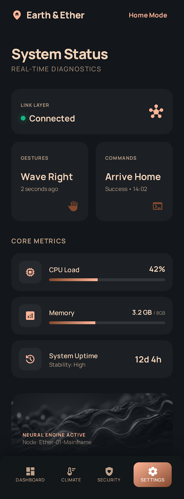

# SmartHome - Raspberry Pi 5 Entegreli Akıllı Ev Uygulaması

SmartHome, Flutter ve Raspberry Pi 5 ile geliştirilen modern, ölçeklenebilir bir akıllı ev kontrol sistemidir. Gerçek zamanlı cihaz yönetimi, istatistikler ve kolay yapılandırma ile ev otomasyonunu basitleştirir.

## Ekran Görüntüleri

Uygulamanın görselleri aşağıda gösterilmektedir:

<p>
	
	
	
</p>
<p>
	
	
</p>

**Görsel Açıklamaları:**
- **Dashboard**: Tüm cihazları göster, hızlı kontrol
- **Cihaz Eşleştirme**: Konumlara göre cihaz yapılandırması
- **Ayarlar**: API sunucusu ve tercihler
- **Odalar**: Oda bazında cihaz yönetimi
- **Etkinlikler**: Sistem geçmişi ve analizler

## Proje Yapısı

```
SmartHome/
├── smart_home/              # Flutter Mobil Uygulaması
│   ├── lib/
│   │   ├── main.dart       # Ana uygulama
│   │   ├── models/         # Veri modelleri
│   │   ├── screens/        # UI ekranları
│   │   ├── services/       # API hizmetleri
│   │   └── widgets/        # Yeniden kullanılabilir bileşenler
│   └── pubspec.yaml        # Flutter bağımlılıkları
│
├── backend/                 # Express.js REST API
│   ├── server.js           # API sunucusu
│   ├── config/             # Konfigürasyon
│   ├── routes/             # API rotaları
│   └── package.json        # Node.js bağımlılıkları
│
├── raspberry_pi/           # Raspberry Pi 5 Kontrolü
│   └── smarthome_controller.py  # GPIO kontrolörü
│
└── Doksimanlar
    ├── README.md           # Bu dosya
    ├── INSTALLATION_GUIDE.md
    ├── QUICKSTART.md
    └── PROJECT_SUMMARY.md
```

## Hızlı Başlangıç

### Windows Kullanıcıları

```bash
install.bat
start.bat
cd smart_home && flutter run
```

### Raspberry Pi Kurulumu

```bash
ssh pi@192.168.1.100
bash install_rpi.sh
bash start.sh
```

### Manuel Kurulum - Backend

```bash
cd backend
npm install
npm start
```

API sunucusu `http://192.168.1.100:3000` adresinde çalışacak.

### Manuel Kurulum - GPIO Kontrolörü

```bash
sudo python3 raspberry_pi/smarthome_controller.py
```

### Manuel Kurulum - Flutter Uygulaması

```bash
cd smart_home
flutter pub get
flutter run
```

## API Endpoints

### Cihaz İşlemleri

| Method | Endpoint | Açıklama |
|--------|----------|----------|
| GET | `/api/devices` | Tüm cihazları listele |
| GET | `/api/devices/:id` | Belirli cihazı getir |
| POST | `/api/devices` | Yeni cihaz ekle |
| POST | `/api/devices/:id/toggle` | Durumu değiştir |
| POST | `/api/devices/:id/value` | Değer güncelle |
| DELETE | `/api/devices/:id` | Cihazı sil |

### Sistem Durumu

| Method | Endpoint | Açıklama |
|--------|----------|----------|
| GET | `/health` | Sistem sağlık durumu |
| GET | `/api/status` | API durumu ve uptime |

## GPIO Pin Yapılandırması

| Cihaz ID | Adı | GPIO Pin | Tür | Fonksiyon |
|----------|-----|----------|-----|----------|
| 1 | Salon Işığı | 17 | Digital | Açık/Kapalı |
| 2 | Yatak Odası | 27 | Digital | Açık/Kapalı |
| 3 | Klima | 22 | PWM | 0-100% |
| 4 | Ön Kapı | 23 | Relay | Açık/Kapalı |
| 5 | Hareket Sensörü | 24 | Input | Okuma |

## GPIO Pin Yapılandırması

| Cihaz ID | Adı | GPIO Pin | Tür | Fonksiyon |
|----------|-----|----------|-----|----------|
| 1 | Salon Işığı | 17 | Digital Output | LED Kontrolü |
| 2 | Yatak Odası Işığı | 27 | Digital Output | LED Kontrolü |
| 3 | Klima Sistemi | 22 | PWM Output | Hız/Sıcaklık (0-100%) |
| 4 | Ön Kapı Kilit | 23 | Relay Output | Açıp Kapama |
| 5 | Hareket Sensörü | 24 | Digital Input | Algılama |

## Mobil Uygulama Özellikleri

### Ana Dashboard
- Gerçek zamanlı cihaz durumu gösterimi
- Hızlı açıp/kapatma kontrolleri
- Işık yoğunluğu slider'ı
- Aktif cihaz sayacı
- Pull-to-refresh desteği

### Cihaz Yönetimi
- Cihaz kartlarında durumu ve değeri görüntüleme
- Tek dokunuşla aç/kapat
- Slider ile hassas kontrol
- Son güncelleme zamanı bilgisi

### İstatistikler Paneli
- Cihaz türlerine göre dağılım grafiği
- Aktif/pasif cihaz oranları
- Detaylı cihaz listesi
- Gerçek zamanlı veri analizi

### Ayarlar Ekranı
- Bildirim yönetimi
- Tema seçimi (Açık/Koyu)
- API sunucusu yapılandırması
- Bağlantı testi özelliği

## Teknik Yığın

### Frontend
- Flutter 3.x - Modern mobile framework
- Provider - State management
- Material Design 3 - Modern UI tasarımı
- HTTP - REST API iletişimi
- FL Chart - Veri görsellendirme

### Backend
- Node.js 20+ - JavaScript runtime
- Express.js - Web framework
- CORS - Cross-origin requests
- Body Parser - JSON işleme
- Dotenv - Ortam yapılandırması

### Embedded Systems
- Python 3.9+ - Scripting language
- RPi.GPIO - GPIO kontrol kütüphanesi
- Requests - HTTP iletişimi
- Threading - Paralel işlem yönetimi

## Sistem Gereksinimleri

### Geliştirme Bilgisayarı

| Bileşen | Minimum | Önerilen |
|---------|---------|----------|
| İşletim Sistemi | Windows 10 / macOS 10.15 / Ubuntu 20.04 | Windows 11 / macOS 12+ / Ubuntu 22.04 |
| RAM | 8 GB | 16 GB |
| Disk Alanı | 10 GB | 20 GB |
| Flutter SDK | 3.0.0+ | Latest |
| Node.js | 18.0+ | 20 LTS |
| Python | 3.9+ | 3.11+ |

### Raspberry Pi 5

| Bileşen | Minimum | Önerilen |
|---------|---------|----------|
| RAM | 4 GB | 8 GB |
| Storage | 32 GB MicroSD | 64 GB MicroSD (UHS-II) |
| Power Supply | 25W USB-C | 27W USB-C |
| Network | WiFi 6 | Ethernet + WiFi 6 |
| OS | Raspberry Pi OS (64-bit) | Raspberry Pi OS Bookworm |

## Kurulum Talimatları

Ayrıntılı kurulum adımları için [INSTALLATION_GUIDE.md](INSTALLATION_GUIDE.md) dosyasını inceleyin.

Hızlı başlangıç için [QUICKSTART.md](QUICKSTART.md) rehberini takip edin.

## Kullanım Örnekleri

### cURL ile API Testi

```bash
# Tüm cihazları getir
curl http://localhost:3000/api/devices

# Salon Işığını aç
curl -X POST http://localhost:3000/api/devices/1/toggle \
  -H "Content-Type: application/json" \
  -d '{"status": true}'

# Işık yoğunluğunu %75'e ayarla
curl -X POST http://localhost:3000/api/devices/1/value \
  -H "Content-Type: application/json" \
  -d '{"value": 75}'

# Sistem durumunu kontrol et
curl http://localhost:3000/health
```

### Flutter Uygulamasında Kullanım

1. **Anasayfa**: Tüm cihazları görün ve kontrol edin
2. **İstatistikler**: Cihaz kullanım verilerini analiz edin
3. **Ayarlar**: API sunucusunu yapılandırın
4. **Cihaz Detayları**: Belirli cihaz hakkında bilgi alın

## Sorun Giderme

### API Bağlantı Hatası

```bash
# API'nin çalışıp çalışmadığını kontrol et
curl http://localhost:3000/health

# Backend logs'ı kontrol et
npm start

# Firewall ayarlarını kontrol et
sudo ufw allow 3000
```

### GPIO Permission Hatası

```bash
# Kullanıcıyı GPIO grubuna ekle
sudo usermod -aG gpio pi

# Terminal'den çıkıp tekrar gir
exit
ssh pi@192.168.1.100
```

### Flutter Emulator Bağlantısı

Android emulator'de `localhost` yerine `10.0.2.2` kullanın:

```dart
// lib/services/device_service.dart
static const String baseUrl = 'http://10.0.2.2:3000/api';
```

## Güvenlik Önerileri

## Güvenlik Önerileri

1. **API Sunucusu**: Firewall arkasında tutun ve port forwarding'i dikkatli yapılandırın
2. **Kimlik Doğrulama**: Token tabanlı yetkilendirme ekleyin
3. **Şifreleme**: HTTPS/SSL sertifikaları kullanın
4. **SSH Anahtarları**: Parola yerine SSH anahtarı tabanlı giriş kullanın
5. **Güvenlik Güncellemeleri**: Düzenli olarak sistem ve bağımlılıkları güncelleyin
6. **Veri Şifreleme**: Hassas bilgileri şifreleyin
7. **Rate Limiting**: API'ye rate limiting ekleyin

## Geliştirilecek Özellikler

- Bildirim sistemi (Push notifications)
- Zaman çizelgesi ve otomasyonu (Scheduling)
- Akıllı kurallar (Automation rules)
- WebSocket gerçek zamanlı güncellemeler
- MQTT protokolü desteği
- Veritabanı entegrasyonu (MongoDB/SQLite)
- Kullanıcı kimlik doğrulaması
- Multi-user desteği
- Cloud senkronizasyonu
- Voice control (Alexa/Google Home)

## Proje Dosyaları

- [README.md](README.md) - Bu dosya
- [INSTALLATION_GUIDE.md](INSTALLATION_GUIDE.md) - Detaylı kurulum rehberi
- [QUICKSTART.md](QUICKSTART.md) - 5 dakikada başlangıç
- [PROJECT_SUMMARY.md](PROJECT_SUMMARY.md) - Teknik özet
- [DIRECTORY_STRUCTURE.md](DIRECTORY_STRUCTURE.md) - Yapı açıklaması
- [CHECKLIST.md](CHECKLIST.md) - Kontrol listesi

## Lisans

MIT License - Ayrıntılar için [LICENSE](LICENSE) dosyasına bakın

## İletişim

- Email: support@smarthome.local
- GitHub: https://github.com/gokaycetinn/SmartHomeFlutter1
- Issues: https://github.com/gokaycetinn/SmartHomeFlutter1/issues

## Teşekkürler

Bu proje aşağıdaki açık kaynak kütüphanelerini kullanmaktadır:

- Flutter ve Material Design
- Express.js
- RPi.GPIO
- Community contributors

---

**Versiyon**: 1.0.0  
**Son Güncelleme**: 26 Mart 2024  
**Durum**: Üretim Hazır
